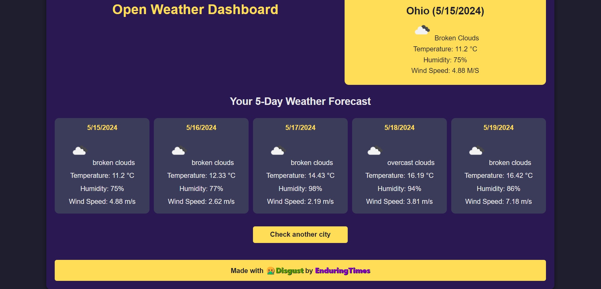

# Open Weather Dashboard

## Overview

The Open Weather Dashboard is a web application that allows users to check the current weather and 5-day forecast for multiple cities. The application is built using HTML, CSS, and JavaScript, and it uses the OpenWeather API to fetch weather data.

## Features

- Search for a city's current weather and 5-day forecast.
- View the city name, date, weather conditions, temperature, humidity, and wind speed.
- Save search history and allow users to revisit past searches.
- Responsive design that works on both desktop and mobile devices.

## Table of Contents

- [Open Weather Dashboard](#open-weather-dashboard)
  - [Overview](#overview)
  - [Features](#features)
  - [Table of Contents](#table-of-contents)
  - [Usage](#usage)
  - [Technologies Used](#technologies-used)
  - [License](#license)

## Usage

1. Open the application in your web browser.
2. Enter the name of a city in the search bar and click "Submit".
3. The current weather and 5-day forecast for the city will be displayed.
4. Previous searches are saved and can be clicked to quickly view weather data again.
5. [Live Application](https://enduringtimes.github.io/OpenWeatherAPI/)

## Technologies Used

- HTML5
- CSS
- JavaScript
- OpenWeather API

## License

This project is licensed under the MIT License. See the [LICENSE](LICENSE) file for details.

